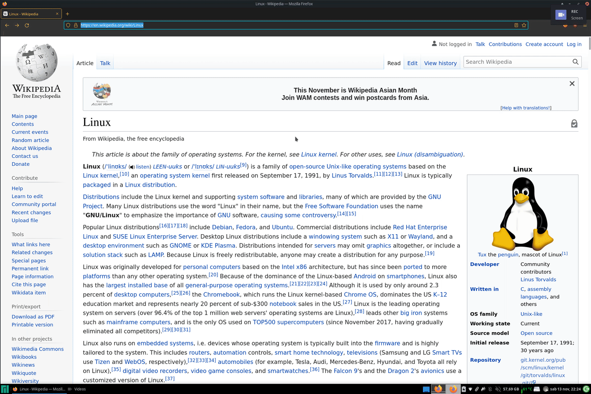
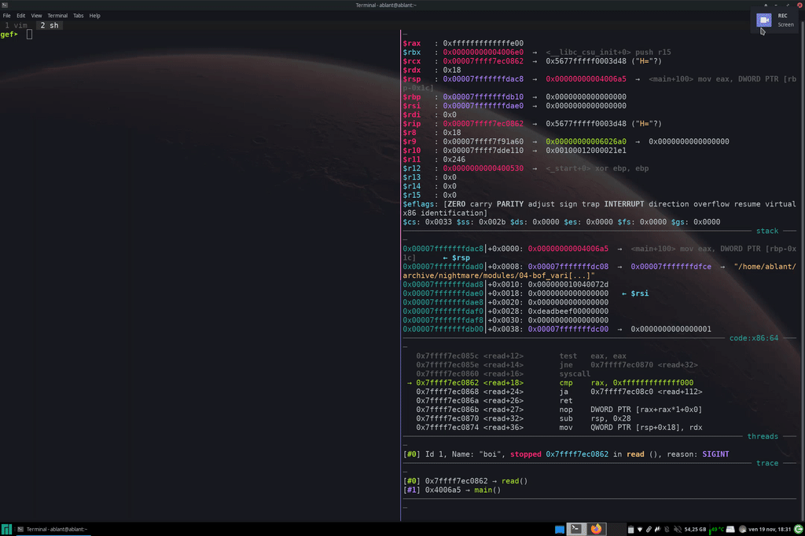
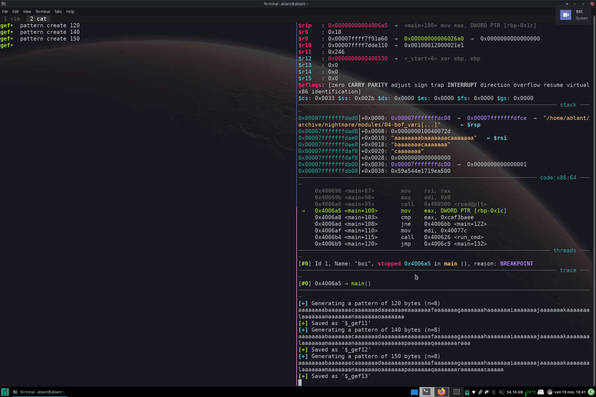
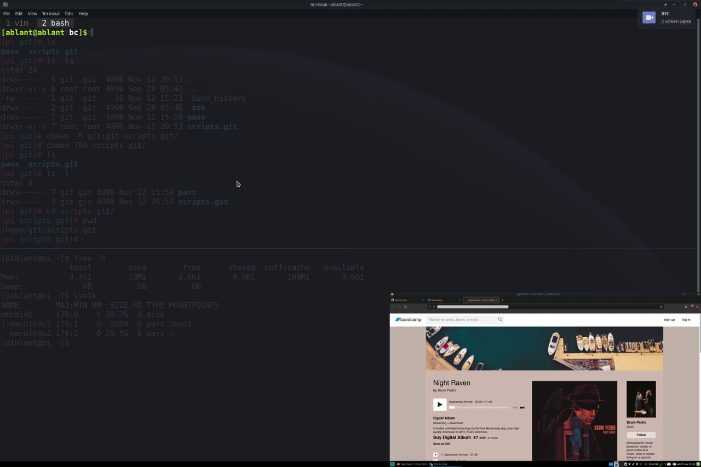

# some random scripts i wrote

i'm a newbe scripter, so any advice/correction is welcomed! 😊

## [aliases](https://github.com/xVss/scripts/blob/master/aliases)

some simple oneliners

## [bookmarks](https://github.com/xVss/scripts/blob/master/bookmarks)

a **browser-independent** simple bookmark script that saves your favourite URLs in a file using the system clipboard and open them back using *rofi*

## [rofi-paste](./rofi-paste)
a little script that manages a _personal_ clipboard where you can save and recover stuff.

one day i needed to try some payloads in gdb, but got tired of choosing the one i wanted with mouse from the clipboard history, so i made this script. hope the gifs explain better what i mean.

#### old workflow

####new workflow

## [bcdl](https://github.com/xVss/scripts/blob/master/bcdl)

a messy *sleepless night* script that downloads albums from Bandcamp, tagging each song with few infos.

very bad but it works.

## [ffmpeg](https://github.com/xVss/scripts/blob/master/ffmpeg)

Some ffmpeg scripts i use for myself

## [search](https://github.com/xVss/scripts/blob/master/search)

system-wide Google and DuckDuckGo search bar
