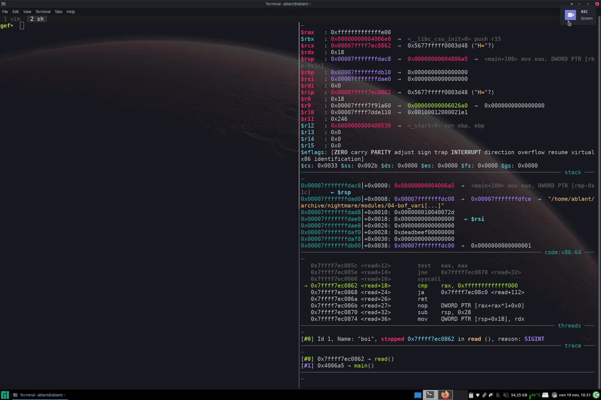
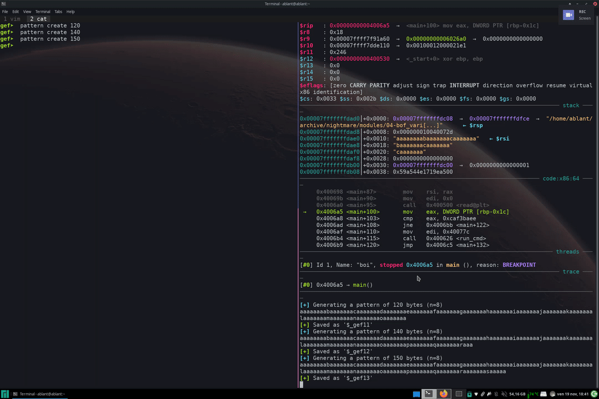

# aliases

some oneliners i wrote to use in vim and other stuff

- [2bin](./2bin) - convert a number **2** **bin**ary
- [2hex](./2hex) - convert a number **2** **hex**adecimal
- [2dec](./2dec) - convert a number **2** **dec**imal
- [deltr](./deltr) - **del**ete **tr**ailing spaces
- [pjson](./pjson) - **p**retty **json**
- [pjs](./pjs) - **p**retty **j**ava**s**cript
- [s2n](./s2n) - convert **s**paces **2** **n**ewlines

- [stream](./stream) - stream video with mpv

- [copy](./copy), [dmenu-paste](./dmenu-paste), [ccp](./ccp) - three little scripts to have a _personal_ clipboard that saves stuff. i made it because i wanted to try different payloads in gdb, but got tired of choosing the one i wanted with mouse from the clipboard history (that was on another screen). hope the gifs explain better what i mean. one day im gonna merge them in a sigle script and have the different behaviours with flag option... but not today

old Workflow

new Workflow

